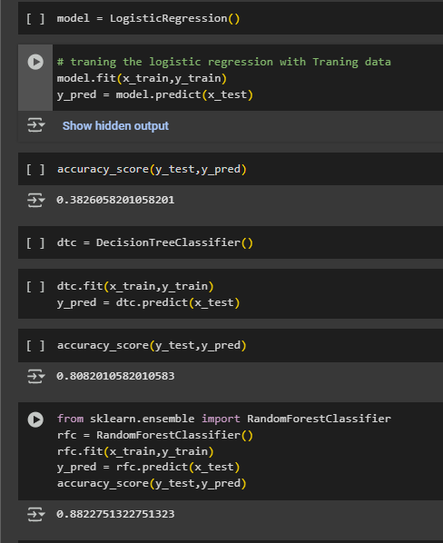
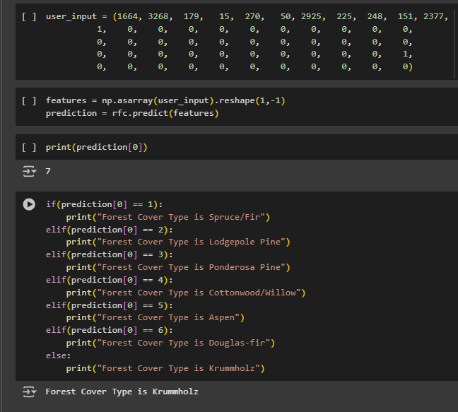

# 🌲 Forest Cover Type Prediction using Machine Learning (Google Colab)

A machine learning project that predicts forest cover types based on cartographic variables using different ML models like **Logistic Regression**, **Decision Tree**, and **Random Forest**. After experimentation, **Random Forest** was found to give the best accuracy of **88.29%**.

---

## 🧠 Project Overview

This project focuses on classifying the forest cover type (e.g., Spruce/Fir, Lodgepole Pine, etc.) using geographic and soil data. Multiple ML models were tested, and the **Random Forest classifier** yielded the highest accuracy.

---

## 📌 Features

    - Exploratory Data Analysis and Cleaning with **pandas**
    - Model building with:
      - Logistic Regression
      - Decision Tree
      - ✅ Random Forest (final)
    - Evaluation with metrics like accuracy and confusion matrix
    - Built and run entirely in **Google Colab**

---

## 📊 Dataset

    - **Source**: [UCI Forest CoverType Dataset](https://archive.ics.uci.edu/ml/datasets/Covertype)
    - **Size**: 581,012 instances, 55 features
    - **Target**: 7 types of forest cover (Multi-class classification)
    - **Features**: Elevation, Aspect, Slope, Horizontal Distance to Hydrology, Soil Type, etc.

---

## 🏗️ Project Structure

    ├── ForestCoverPrediction.ipynb # Main Colab notebook
    ├── cover_data.csv # Dataset (uploaded to Colab)
    ├── assets/
     ├── accuracy_comparison.png
     └── sample_prediction.png

 
---

## 📸 Screenshots

### 📊 Model Accuracy Comparison

### 🔍 Prediction Output Sample

---

## 🚀 Model Accuracy Results

    | Model               | Accuracy  |
    |-------------------- |------------|
    | Logistic Regression | ~58%       |
    | Decision Tree       | ~70%       |
    | ✅ Random Forest    | **88.29%** |

---

## ▶️ Run on Google Colab

    1. Upload the dataset (`train.csv`)
    2. Run each cell in order
    3. The notebook will show evaluation and predictions

---

## ⚙️ Tech Stack

    - Python
    - Google Colab
    - Pandas
    - Scikit-learn
    - NumPy
    - Matplotlib & Seaborn (for visualization)

---

## 🧠 What I Learned

    - Importance of feature preprocessing in large datasets
    - Model comparison and parameter tuning
    - Why Random Forest is often a better choice for high-dimensional data
    - Evaluating multi-class classification models with confusion matrices

---

## 🙋‍♂️ Author

**Shivam Shaw**
    
    - [GitHub](https://github.com/shivamwebsite/Forest-Cover_Predictions)
    - [LinkedIn](https://linkedin.com/in/shivam-shaw-a9288a272)

---

## 📜 License

    This project is licensed under the MIT License - see the [LICENSE](LICENSE) file for details.
